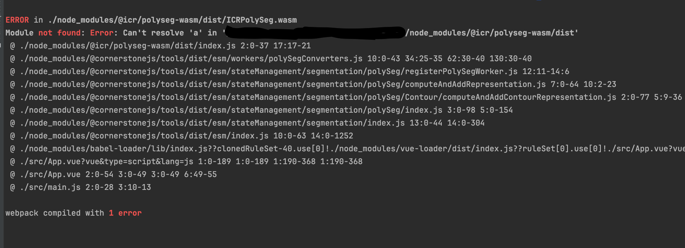

## QuickStart
```shell
yarn install

# Compiles and hot-reloads for development
yarn serve
```

## Questions
After I create the vue3 project via

First , I only execute
```shell
yarn add @cornerstonejs/core@1.66.9
yarn add @cornerstonejs/tools@1.66.9
```

Then , in order to fix: 
```
node_modules/@cornerstonejs/tools/dist/esm/utilities/segmentation/InterpolationManager/InterpolationManager.js: Static class blocks are not enabled. Please add `@babel/plugin-transform-class-static-block` to your configuration.
```

I also `yarn add @babel/plugin-transform-class-static-block`
And then modify the `babel.config.js`

Then , I execute `yarn serve` will get
```
ERROR in ./node_modules/@icr/polyseg-wasm/dist/ICRPolySeg.wasm 1:0
Module parse failed: Unexpected character '' (1:0)
The module seem to be a WebAssembly module, but module is not flagged as WebAssembly module for webpack.
BREAKING CHANGE: Since webpack 5 WebAssembly is not enabled by default and flagged as experimental feature.
You need to enable one of the WebAssembly experiments via 'experiments.asyncWebAssembly: true' (based on async modules) or 'experiments.syncWebAssembly: true' (like webpack 4, deprecated).
For files that transpile to WebAssembly, make sure to set the module type in the 'module.rules' section of the config (e. g. 'type: "webassembly/async"').
(Source code omitted for this binary file)
 @ ./node_modules/@icr/polyseg-wasm/dist/index.js 2:0-37 17:17-21
 @ ./node_modules/@cornerstonejs/tools/dist/esm/workers/polySegConverters.js 10:0-43 34:25-35 62:30-40 130:30-40
 @ ./node_modules/@cornerstonejs/tools/dist/esm/stateManagement/segmentation/polySeg/registerPolySegWorker.js 12:11-14:6
 @ ./node_modules/@cornerstonejs/tools/dist/esm/stateManagement/segmentation/polySeg/computeAndAddRepresentation.js 7:0-64 10:2-23
 @ ./node_modules/@cornerstonejs/tools/dist/esm/stateManagement/segmentation/polySeg/Contour/computeAndAddContourRepresentation.js 2:0-77 5:9-36
 @ ./node_modules/@cornerstonejs/tools/dist/esm/stateManagement/segmentation/polySeg/index.js 3:0-98 5:0-154
 @ ./node_modules/@cornerstonejs/tools/dist/esm/stateManagement/segmentation/index.js 13:0-44 14:0-304
 @ ./node_modules/@cornerstonejs/tools/dist/esm/index.js 10:0-63 14:0-1252
 @ ./node_modules/babel-loader/lib/index.js??clonedRuleSet-40.use[0]!./node_modules/vue-loader/dist/index.js??ruleSet[0].use[0]!./src/App.vue?vue&type=script&lang=js 2:0-57 9:30-46
 @ ./src/App.vue?vue&type=script&lang=js 1:0-189 1:0-189 1:190-368 1:190-368
 @ ./src/App.vue 2:0-54 3:0-49 3:0-49 6:49-55
 @ ./src/main.js 2:0-28 3:10-13
```

Then I modify `vue.config.js`
```js
const { defineConfig } = require('@vue/cli-service')
module.exports = defineConfig({
    transpileDependencies: true,
    configureWebpack: {
        experiments: {
            syncWebAssembly: true,
            asyncWebAssembly: true
        }
    },
})

```
I will get error
```
ERROR  Failed to compile with 1 error                                                                                                                                                              4:44:43 PM

error  in ./node_modules/@icr/polyseg-wasm/dist/ICRPolySeg.wasm

Module not found: Error: Can't resolve 'a' in '/Users/XXX/tmu/vue-cornerstone/node_modules/@icr/polyseg-wasm/dist'

ERROR in ./node_modules/@icr/polyseg-wasm/dist/ICRPolySeg.wasm 
Module not found: Error: Can't resolve 'a' in '/Users/XXX/tmu/vue-cornerstone/node_modules/@icr/polyseg-wasm/dist'
 @ ./node_modules/@icr/polyseg-wasm/dist/index.js 2:0-37 17:17-21
 @ ./node_modules/@cornerstonejs/tools/dist/esm/workers/polySegConverters.js 10:0-43 34:25-35 62:30-40 130:30-40
 @ ./node_modules/@cornerstonejs/tools/dist/esm/stateManagement/segmentation/polySeg/registerPolySegWorker.js 12:11-14:6
 @ ./node_modules/@cornerstonejs/tools/dist/esm/stateManagement/segmentation/polySeg/computeAndAddRepresentation.js 7:0-64 10:2-23
 @ ./node_modules/@cornerstonejs/tools/dist/esm/stateManagement/segmentation/polySeg/Contour/computeAndAddContourRepresentation.js 2:0-77 5:9-36
 @ ./node_modules/@cornerstonejs/tools/dist/esm/stateManagement/segmentation/polySeg/index.js 3:0-98 5:0-154
 @ ./node_modules/@cornerstonejs/tools/dist/esm/stateManagement/segmentation/index.js 13:0-44 14:0-304
 @ ./node_modules/@cornerstonejs/tools/dist/esm/index.js 10:0-63 14:0-1252
 @ ./node_modules/babel-loader/lib/index.js??clonedRuleSet-40.use[0]!./node_modules/vue-loader/dist/index.js??ruleSet[0].use[0]!./src/App.vue?vue&type=script&lang=js 2:0-57 15:30-46
 @ ./src/App.vue?vue&type=script&lang=js 1:0-189 1:0-189 1:190-368 1:190-368
 @ ./src/App.vue 2:0-54 3:0-49 3:0-49 6:49-55
 @ ./src/main.js 2:0-28 3:10-13

webpack compiled with 1 error
```


